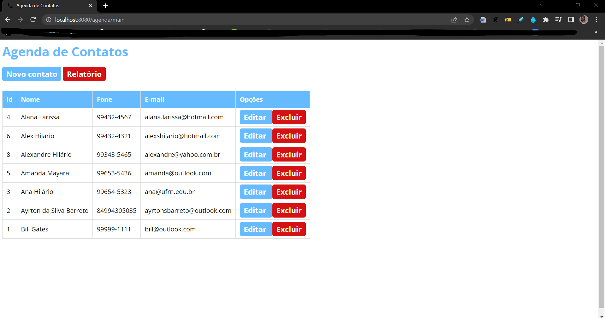
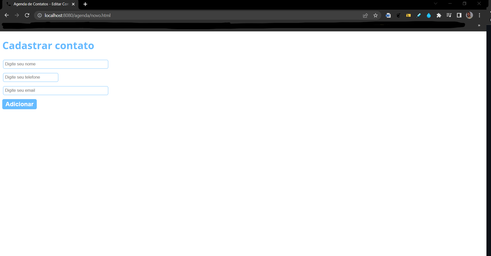
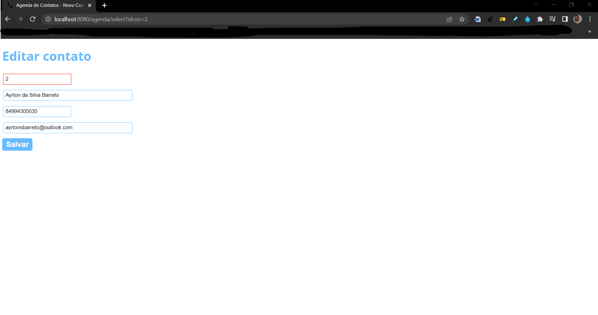
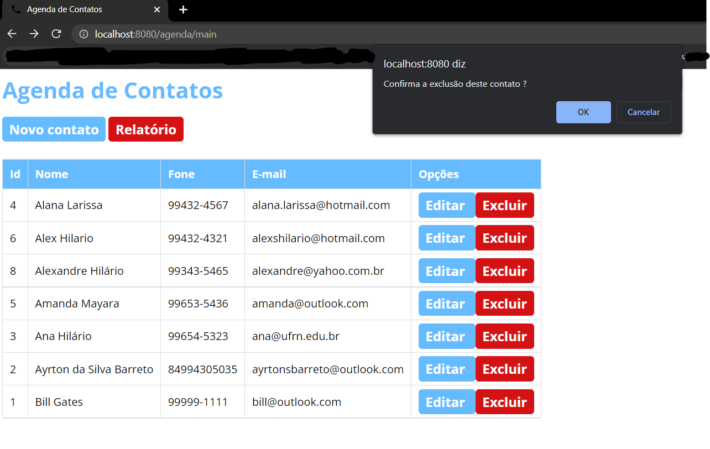
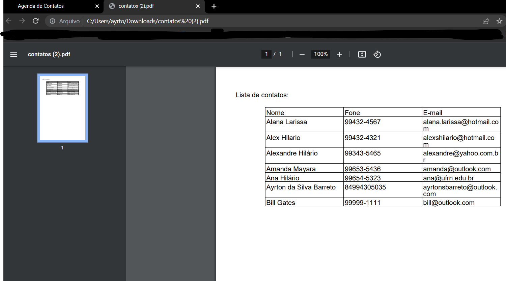

  

<h1 align="center">Agenda de contatos</h1>

<h2>🎯 Objetivo do Projeto</h2>

Implantação de um projeto de <strong>agenda de contatos</strong>, no qual é possível cadastrar, atualizar, listar e remover um contato.

<h2>🛠 Tecnologias Utilizadas</h2>

<ul>
    <li>IDE Eclipse</li>
    <li>Java EE (J2EE) - Servlet e JSP</li>
    <li>Maven</li>
    <li>JDBC (Java Database Connectivity)</li>
    <li>Servidor Tomcat</li>
    <li>MySQL CRUD</li>
    <li>MVC (Model View Controller)</li>
    <li>Lombok</li>
    <li>Biblioteca iText</li>
    <li>JavaBeans</li>
    <li>DAO</li>
</ul>

<h2>💻 Imagens do Sistema </h2>

<h3> ✅ Lista de Contatos </h3>

  

<h3> ✅ Cadastro de Contato </h3>

  

<h3> ✅ Edição de Contato </h3>

  

<h3> ✅ Exclusão de Contato </h3>

  

<h3> ✅ Relatório de Contatos </h3>

  

